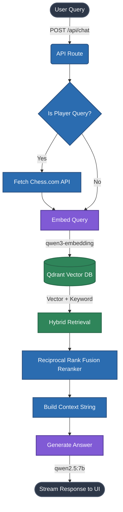

<div align="center">
  
  <h1>♞ Chessopedia GPT</h1>
  <p><em>Your intelligent, fully-local, encyclopaedic chess assistant.</em></p>

  <p>
    <a href="#-features"><strong>Features</strong></a> ·
    <a href="#-tech-stack"><strong>Tech Stack</strong></a> ·
    <a href="#-quick-start"><strong>Quick Start</strong></a> ·
    <a href="#-architecture"><strong>Architecture</strong></a> ·
    <a href="#-project-structure"><strong>Structure</strong></a>
  </p>

  <p>
    
    
    
    
  </p>
</div>

<br />

> **Chessopedia GPT** is a local RAG (Retrieval-Augmented Generation) application designed exclusively for chess enthusiasts. Whether you are curious about complex opening theories, historical games, FIDE rating mechanics, or player biographies, Chessopedia GPT delivers accurate, grounded answers powered by a custom locally hosted knowledge base.

<br />

## ✨ Features

### 🧠 100% Local Inference
Your data stays yours. All LLM generation and vector embeddings happen on your local machine using Ollama. No data is sent to OpenAI, Anthropic, or any third-party cloud providers, meaning **zero API costs**.

### 📚 Grounded Knowledge (RAG)
No more AI hallucinations. Responses are strictly augmented with retrieved facts from a comprehensive chess database. If the system doesn't know, it honestly tells you, rather than guessing.

### ⚡ Lightning-Fast Hybrid Search
Combines dense semantic vector search with keyword-based retrieval. Results are refined using a highly optimized, pure-compute mathematical reranker based on **Reciprocal Rank Fusion (RRF)** for maximum accuracy.

### ♟️ Real-time Player Statistics
Integrates seamlessly with the public **Chess.com API** to fetch up-to-the-minute player data, Elo ratings, and profiles, blending live stats with historical context.

### 🎨 Premium, Typography-First UI
A beautiful, responsive interface designed with a dark, editorial, warm aesthetic. Features smooth streaming responses, dynamic loading states, and custom CSS without heavy frameworks.

---

## 🛠️ Tech Stack

### Frontend & Core Framework
*   **Next.js 15 (React 19)**: App router, server-side rendering, and API orchestration.
*   **Vanilla CSS**: Custom styling with CSS variables (`global.css`).

### AI & Machine Learning
*   **Ollama**: Local inference engine.
*   **Qwen 2.5 (7B)** (`qwen2.5:7b`): The primary conversational model.
*   **Qwen 3 Embedding** (`qwen3-embedding:0.6b`): Creates highly accurate vector representations of text.

### Database & Data Processing
*   **Qdrant**: High-performance local vector database (via Docker).
*   **Node-Cache**: In-memory caching to prevent rate-limiting and redundant computations.
*   **LangChain**: Intelligent text chunking (`RecursiveCharacterTextSplitter`) for the knowledge base.
*   **Puppeteer & Cheerio**: Web scraping utilities to build the chess corpus.

---

## 🚀 Quick Start

### Prerequisites
Before you begin, ensure you have the following installed:
*   [Node.js 20+](https://nodejs.org/)
*   [Docker](https://www.docker.com/) (Required for Qdrant)
*   [Ollama](https://ollama.com/) (Required for Local AI)

### 1. Installation

Clone the repository and install the required dependencies:

```bash
git clone https://github.com/yourusername/chessopedia-gpt.git
cd chessopedia-gpt
npm install
```

### 2. Environment Setup

Create your environment file:

```bash
cp .env.example .env
```
*(No API keys are required! Everything runs completely locally.)*

### 3. Pull Required AI Models

Use Ollama to download the language and embedding models. This may take a few minutes depending on your internet connection:

```bash
ollama pull qwen2.5:7b
ollama pull qwen3-embedding:0.6b
```

### 4. Start the Database

Run Qdrant via Docker in the background:

```bash
docker run -d -p 6333:6333 --name qdrant qdrant/qdrant
```

### 5. Initialize the Knowledge Base

Set up the Qdrant collections and indexes, then seed them with the chess data:

```bash
npm run setup-qdrant
npm run seed
```

> [!WARNING]  
> **Seeding Note:** The raw structured data (`scripts/Data/structured/*.json`) is required for the seed step. If these files are missing (they are ignored in git by default due to size), you must run the scraper scripts in the `scripts/` directory first to generate them.

### 6. Run the Application

Start the development server:

```bash
npm run dev
```
Navigate to [http://localhost:3000](http://localhost:3000) in your browser.

---

## 🏗️ Architecture

Below is the execution flow of a single query inside Chessopedia GPT:



---

## 📂 Project Structure

```text
chessopedia-gpt/
├── app/
│   ├── api/             # Next.js API routes (chat, player, profile)
│   ├── components/      # Reusable React components (Bubble, Prompts)
│   ├── global.css       # Custom design system and styling
│   └── page.tsx         # Main chat interface
├── lib/                 # Core business logic
│   ├── cache.ts         # In-memory caching logic
│   ├── embedder.ts      # Vector embedding pipeline
│   ├── generator.ts     # LLM streaming and prompt engineering
│   ├── qdrant.ts        # Database connection
│   ├── reranker.ts      # Custom mathematical reranker
│   └── retriever.ts     # Hybrid search logic
├── scripts/             # Data pipeline and DB setup
│   ├── Data/            # Scraped and structured datasets
│   ├── scrapeData.ts    # Puppeteer/Cheerio scraping scripts
│   ├── setupQdrant.ts   # Database initialization
│   └── seedQdrant.ts    # Data embedding and upsertion script
└── README.md
```

---

## 🔐 Security & Privacy
*   **Completely Offline Capable:** Once models are downloaded, the core RAG pipeline can operate without an internet connection.
*   **No Telemetry:** Zero tracking, analytics, or data collection.
*   **Payload Hardening:** API routes enforce strict request body limits (50KB max) and input length validation to prevent SSRF and buffer abuse.

---

## 📜 License

This project is open-source and licensed under the [MIT License](LICENSE).
